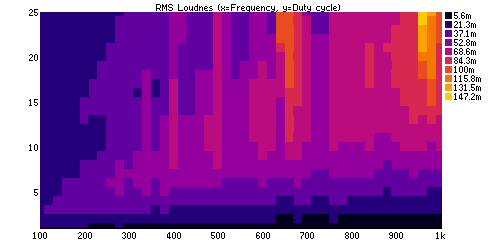
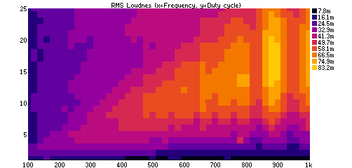
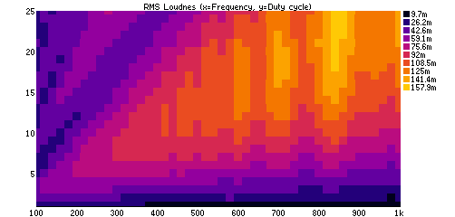

# buzzer-volume-maximizer
Maximize volume of a buzzer by tuning frequency and duty cycle and measuring RMS volume

# How it works

First program arduino with code provided in arduino directory. It listens on serial port
and read commands to change duty and frequency of PWM pin, and then it beeps for half a second.

Main control bash script 1-record-samples.sh will sweep through all values of duty from 1 to 25 (out of 255)
and through all values of frequency (100 Hz to 1kHz) and records the beep using PC's mic input. This takes approximately 
40 minutes (25 duty values * 45 frequency values * 2s = 37 minutes). Wav files are saved in "wav" folder.

When all WAV files are saved, bash script "2-analyze-loudness-sox-rms.sh" will use "sox" tool to get RMS value of the
each file.

Finally last script "3-make-chart.ngjs" will create scatter chart from RMS data.

# Results

I've tested 3 buzzers.

Standard passive 12mm 16ohm 5V buzzer:

Tiny 16mm 8ohm speaker:

30mm 30ohm speaker from headphones:

